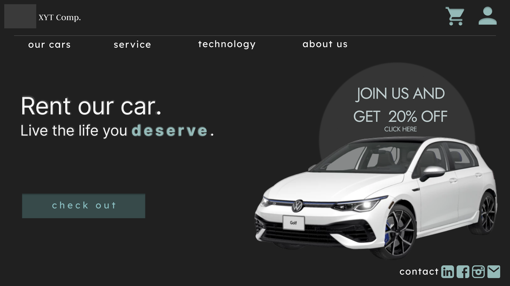

# Car Sharing Website

## Overview

This Figma project is about car sharing. It includes a main page, details about three cars available for sharing, and a sign-in and sign-up panel.

## Usage

To view and interact with the car sharing designs in Figma, follow these steps:

1. Clone the repository: `git clone https://github.com/roma331/FigmaProjects/tree/main/CAR%20SHARING`
2. Open Figma and create a new project.
3. Import the project files from your local repository.

## License
Information and photos of the car are from the original manufacturer: https://www.vw.com/en/models.html
I am not the owner and the project was created for educational purposes only. 
